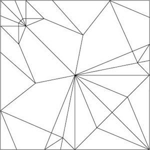
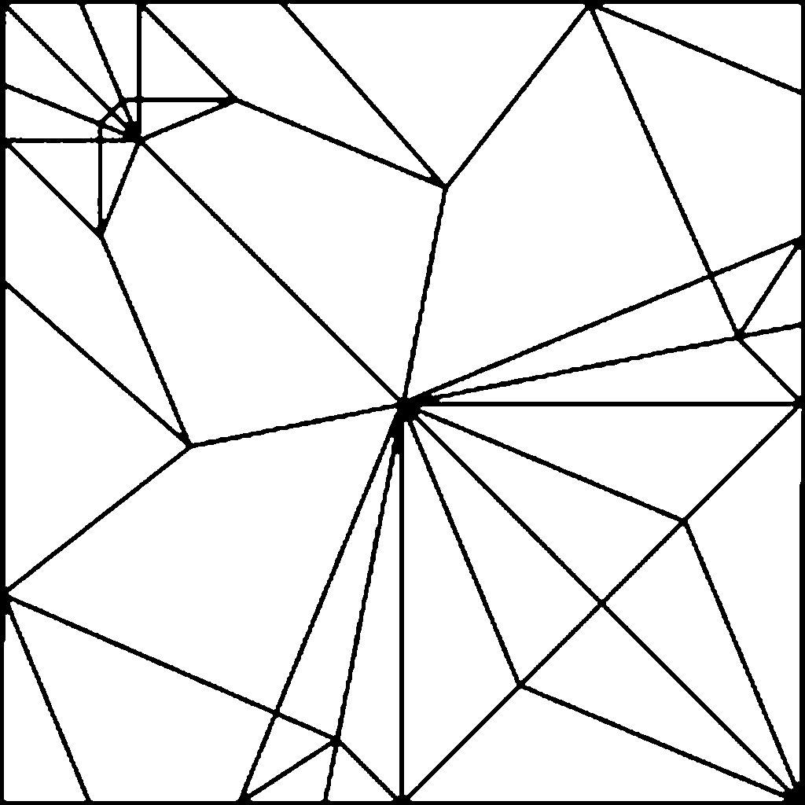
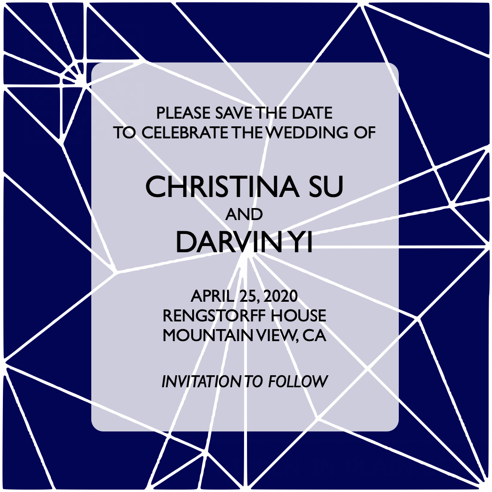

# wedding
Code for wedding directory.

## Required Packages

You need [ImageMagick](https://imagemagick.org/) and [Potrace](http://potrace.sourceforge.net/).

Installation directions for ImageMagick can be found on their [download site](https://imagemagick.org/script/download.php).  Alternatively, you can download the MacOS version at [this link](https://imagemagick.org/download/binaries/ImageMagick-x86_64-apple-darwin19.0.0.tar.gz).  Extract the contents and set the `MAGICK_HOME` environment variable to the extracted path.  Similarly, add the `bin` subdirectory to `PATH` and the `lib` subdirectory to `DYLD_LIBRARY_PATH`.

```
export MAGICK_HOME="$HOME/ImageMagick-7.0.9"
export PATH="$MAGICK_HOME/bin:$PATH"
export DYLD_LIBRARY_PATH="$MAGICK_HOME/lib:$DYLD_LIBRARY_PATH"
```

We can download the MacOS version of Potrace with [this link](http://potrace.sourceforge.net/download/1.16/potrace-1.16.mac-x86_64.tar.gz).  Extract Potrace and add its directory to `PATH`.

```
export PATH="$HOME/potrace-1.16.mac-x86_64:$PATH"
```

It should be noted that all of these programs are third-party apps, and you will need to make sure that your MacOS will allow third-party apps.  Directions can be found [here](https://www.geekrar.com/how-to-allow-third-party-apps-install-on-macos-catalina/) for enabling permission on Catalina.  Basically, on Terminal, input

```
sudo spctl --master-disable
```


## Creating Environment with Required Packages

Let's be clean about it.

```
conda create -n wedding python=3.5 anaconda
conda activate wedding

conda install -n wedding -c menpo opencv
```

## Downloading the Origami Images

We use [this site](http://origami-fantasia.com/e/gallery.html) to find apt origami fold patterns.  Origami fold patterns in the raw look like this:



## Creating SVG from JPG

To do this, we run the following:

```
convert image.png image.ppm
potrace -s image.ppm -o image.svg
```

This is the command line usage of creating vector graphics from the jpg's.  We add an additional preprocessing step by converting the downloaded origami jpg's.  We'll run

```
python jpg2svg.py --f [path of origami jpg's] --temp [path of tempory directory]
```

This will go through all the origami .jpg's, do image interpolation and binary closing for smoothness, and then save them as a .png.  This will give us very clean and crisp lines, which we can see below:



Following this step, we can run the `convert` and `potrace` commands above to get really clean vector graphics.

## Graphics Program

For all of our graphics, we used a MacOS app called [Omnigraffle](https://www.omnigroup.com/omnigraffle/).  It's sort of a hacky, dumbed-down version of Adobe Illustrator.

We use these to create the baseline image:


## Embedding the QR Codes

We generate the QR codes for the sites with [this website](http://zxing.appspot.com/generator/).  It's simple enough and should work well.

Once generated, we will combine the QR code images:


with the text image


to create our finalized save the dates.



We do this with `add_code.py`.


